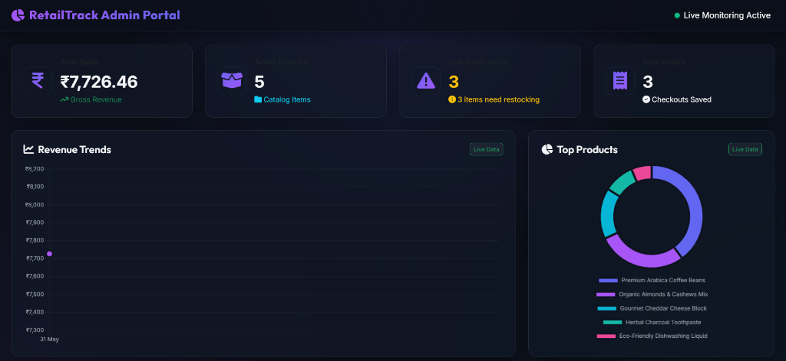
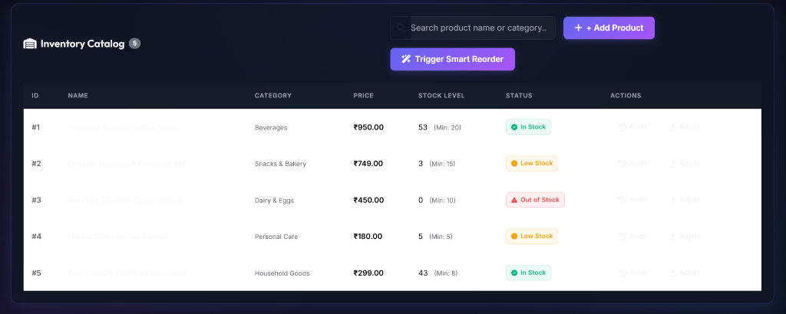

# 🏪 RetailTrack — Inventory & Billing Management System


RetailTrack is a modern, high-performance inventory and billing management system built using Spring Boot 3.5, Hibernate/JPA, and MySQL. Designed to streamline day-to-day retail operations, it provides real-time stock tracking, an automated restocking scheduler driven by a prioritized Min-Heap engine, a high-speed greedy discount optimizer, and a robust billing system with automated GST computation and invoice generation. With an interactive frontend powered by Bootstrap 5 and Chart.js, RetailTrack transforms complex inventory audits and sales analysis into a seamless, visual experience.

## 🚀 Key Features

- **Real-Time Inventory Tracking**: Instantly monitor stock quantities, audit history, and low-stock alerts.
- **Smart Billing & GST Engine**: Automated GST calculation based on dynamic category-specific slabs, with robust billing generation.
- **Greedy Discount Optimizer**: Optimizes promotional codes by dynamically selecting up to two active coupons to maximize customer savings on checkouts.
- **Min-Heap Reorder Engine**: Prioritizes low-stock items using a custom Priority Queue algorithm that evaluates current stock levels, thresholds, average daily sales, and supplier lead times.
- **Bulk Stock Operations**: Utilizes raw Spring JDBC Templates to bypass JPA overhead, facilitating rapid bulk adjustments.
- **Stock Audit Logging**: Tracks every change in inventory (sales, restocks, manual adjustments) to build a robust, queryable history.
- **Interactive Dashboards**: Interactive charts utilizing Chart.js displaying live sales analytics, category distributions, and critical restock items.

## 🧠 Algorithms Implemented

- **Greedy Discount Engine**: Evaluates all active, valid coupons in the database. It dynamically selects up to two coupons that yield the highest cumulative savings for a cart's subtotal and applies them, adjusting the final order totals proportionally across all items.
- **Min-Heap Reorder Engine**: Calculates a custom urgency score `(stock - threshold) / (daily_sales * lead_time)` for all low-stock items. By loading items into a Min-Heap (Priority Queue), it identifies and resolves the most critical restocking needs first and drafts automated pending orders.

## 🏗️ Tech Stack

| Layer | Technology |
|---|---|
| **Backend Framework** | Spring Boot 3.5 (Java 21) |
| **Database** | MySQL 8.x |
| **ORM / Data Access** | Spring Data JPA / Hibernate & Spring JdbcTemplate |
| **Testing** | JUnit 5, Mockito |
| **Frontend** | Vanilla JS, Bootstrap 5, Chart.js, HTML5, CSS3 |
| **Build Tool** | Apache Maven |
| **Utilities** | Lombok, Jackson, Slf4j |

## 📁 Project Structure

```text
src/main/java/Retailtrack/retailtrack/
├── RetailtrackApplication.java
├── controller/
│   ├── CategoryController.java
│   ├── CouponController.java
│   ├── InvoiceController.java
│   ├── OrderController.java
│   ├── ProductController.java
│   ├── ReorderEngineController.java
│   ├── StockAuditController.java
│   └── SupplierController.java
├── dto/
│   ├── ReorderItemPriorityDTO.java
│   ├── request/
│   │   ├── CategoryRequestDTO.java
│   │   ├── CouponRequestDTO.java
│   │   ├── OrderItemRequestDTO.java
│   │   ├── OrderRequestDTO.java
│   │   ├── ProductRequestDTO.java
│   │   └── SupplierRequestDTO.java
│   └── response/
│       ├── CategoryResponseDTO.java
│       ├── CouponResponseDTO.java
│       ├── InvoiceResponseDTO.java
│       ├── OrderResponseDTO.java
│       ├── ProductResponseDTO.java
│       ├── StockMovementResponseDTO.java
│       └── SupplierResponseDTO.java
├── entity/
│   ├── Category.java
│   ├── Coupon.java
│   ├── Invoice.java
│   ├── Order.java
│   ├── OrderItem.java
│   ├── Product.java
│   ├── ProductSupplier.java
│   ├── ProductSupplierId.java
│   ├── ReorderRequest.java
│   ├── StockAudit.java
│   ├── Supplier.java
│   └── enums/
│       ├── DiscountType.java
│       ├── OrderStatus.java
│       ├── ReorderStatus.java
│       └── StockEventType.java
├── exception/
│   ├── ErrorResponse.java
│   ├── GlobalExceptionHandler.java
│   ├── InsufficientStockException.java
│   ├── InvalidCouponException.java
│   └── ResourceNotFoundException.java
├── repository/
│   ├── CategoryRepository.java
│   ├── CouponRepository.java
│   ├── InvoiceRepository.java
│   ├── OrderItemRepository.java
│   ├── OrderRepository.java
│   ├── ProductRepository.java
│   ├── ProductSupplierRepository.java
│   ├── ReorderRequestRepository.java
│   ├── StockAuditRepository.java
│   └── SupplierRepository.java
├── scheduler/
│   └── AutomatedReorderScheduler.java
└── service/
    ├── CategoryService.java
    ├── CouponService.java
    ├── InvoiceService.java
    ├── OrderService.java
    ├── ProductService.java
    ├── ReorderEngineService.java
    ├── StockAuditService.java
    ├── SupplierService.java
    └── impl/
        ├── CategoryServiceImpl.java
        ├── CouponServiceImpl.java
        ├── InvoiceServiceImpl.java
        ├── OrderServiceImpl.java
        ├── ProductServiceImpl.java
        ├── ReorderEngineServiceImpl.java
        ├── StockAuditServiceImpl.java
        └── SupplierServiceImpl.java
```

## ⚙️ Setup & Run

### 1. Clone the Repository
```bash
git clone https://github.com/sambodhit135/-RetailTrack-Inventory-Billing-Management-System.git
cd -RetailTrack-Inventory-Billing-Management-System
```

### 2. Configure MySQL Database
Create a local MySQL database named `retailtrack_db`:
```sql
CREATE DATABASE retailtrack_db;
```

### 3. Configure application.properties
Copy the example properties file and fill in your details:
```bash
cp src/main/resources/application.properties.example src/main/resources/application.properties
```
Open `src/main/resources/application.properties` and replace `your_password_here` with your local MySQL password:
```properties
spring.datasource.password=your_mysql_password
```

### 4. Build and Run the Server
Use the Maven wrapper to clean, build, and boot the application:
```bash
./mvnw clean spring-boot:run
```
Once initialized, navigate to `http://localhost:8080` in your web browser to access the frontend dashboard.

## 🗄️ Database Schema

The database consists of the following 11 entity models:

1. **`Category` (`categories` table)**: Represents product groups and defines the specific GST slab rate applicable (e.g. 5%, 12%, 18%).
2. **`Supplier` (`suppliers` table)**: Holds information on wholesalers, including contact details and fulfillment lead time in days.
3. **`Product` (`products` table)**: The central catalog entity containing names, prices, current stock quantities, and low-stock reorder thresholds.
4. **`ProductSupplier` (`product_suppliers` table)**: A many-to-many join table tracking multiple suppliers associated with different catalog products.
5. **`ProductSupplierId` (JPA Embeddable)**: Helper class representing the composite primary key for the many-to-many product-supplier mapping.
6. **`Coupon` (`coupons` table)**: Manages promotional discounts, supporting percentage or flat types with minimum cart conditions.
7. **`Order` (`orders` table)**: Captures checkout transactions, tracking billing summaries, total discount, total GST, and order status.
8. **`OrderItem` (`order_items` table)**: Represents line items inside each checkout order, calculating individual item subtotal and GST.
9. **`Invoice` (`invoices` table)**: Contains unique invoice numbers generated and linked to successful checkout transactions.
10. **`StockAudit` (`stock_audit` table)**: Logs historical inventory change events including sales, restocks, and manual adjustments.
11. **`ReorderRequest` (`reorder_requests` table)**: Represents restock requests generated automatically by the Min-Heap priority queue scheduler.

## 📊 API Endpoints

| Method | Endpoint | Description |
|---|---|---|
| **GET** | `/api/products` | Retrieve list of all catalog products |
| **POST** | `/api/products` | Create a new catalog product |
| **GET** | `/api/products/{id}` | Retrieve details of a specific product |
| **PUT** | `/api/products/{id}` | Update product details (e.g., name, price) |
| **POST** | `/api/products/bulk-stock-update` | Execute bulk stock adjustment bypass using JDBC |
| **GET** | `/api/products/{id}/audit-log` | Retrieve stock change history logs for a product |
| **POST** | `/api/orders` | Checkout cart items, apply greedy discounts, compute GST |
| **GET** | `/api/orders/{id}` | Retrieve details of a specific order transaction |
| **GET** | `/api/orders` | Retrieve list of all checkout orders |
| **GET** | `/api/invoices/order/{orderId}` | Fetch invoice mappings for a completed order |
| **GET** | `/api/invoices/render/{orderId}` | Generate HTML/PDF renderable layout of an invoice |
| **GET** | `/api/reorder/critical` | Fetch prioritized low-stock items using Min-Heap priority queue |
| **POST** | `/api/reorder/trigger` | Manually run the auto-scheduler to draft restock requests |
| **POST** | `/api/coupons` | Register a new promotional coupon code |
| **GET** | `/api/coupons` | Retrieve active, unexpired coupons |
| **GET** | `/api/categories` | Retrieve all product categories |
| **POST** | `/api/categories` | Create a new product category with GST slab |
| **GET** | `/api/suppliers` | Retrieve list of all suppliers |
| **POST** | `/api/suppliers` | Register a new supplier with lead times |

## 🧪 Testing

The codebase is backed by a robust test suite powered by **JUnit 5** and **Mockito**. It includes service-layer unit tests and a full **End-to-End (E2E) test suite** verifying checkout flows, stock updates, invoice generation, and greedy discount optimization. The project maintains a **78% class coverage** rate to ensure code quality and system resilience.

To run tests:
```bash
./mvnw test
```

## 📸 Screenshots

### 🖥️ Admin Dashboard — Live Analytics
> Real-time revenue tracking, low stock alerts, top products donut chart, and live revenue trend line — all pulling from the Spring Boot API.



### 📦 Inventory Catalog — Stock Management
> Live inventory table with smart status badges (In Stock / Low Stock / Out of Stock), reorder threshold display, and one-click Smart Reorder Engine trigger.



## 👨‍💻 Author

- **Name**: Sambodhi
- **LinkedIn**: [LinkedIn Profile](https://www.linkedin.com/in/sambodhit135/)
